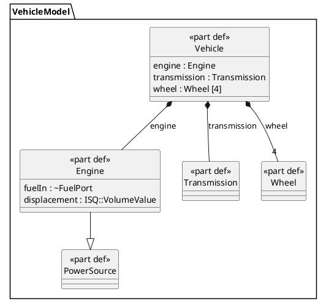
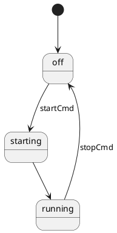
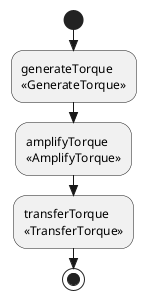
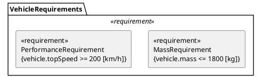

# sysml2-mode — AI Code Generation Specification

**Purpose**: This document is the PRIMARY instruction set for an AI generating the `sysml2-mode` codebase. The companion `sysml2-mode-architecture.md` provides domain context. When in conflict, THIS document governs.

---

## GENERATION RULES

### Rule 1: File Generation Order (Strict)

Generate files in EXACTLY this order. Each file may only reference files generated before it. Do NOT skip files. Do NOT merge files.

```
1.  sysml2-vars.el          (zero dependencies — all defcustom/defvar)
2.  sysml2-lang.el          (depends on: sysml2-vars)
3.  sysml2-font-lock.el     (depends on: sysml2-lang)
4.  sysml2-indent.el        (depends on: sysml2-lang)
5.  sysml2-completion.el    (depends on: sysml2-lang)
6.  sysml2-navigation.el    (depends on: sysml2-lang)
7.  sysml2-snippets.el      (depends on: sysml2-lang)
8.  sysml2-lsp.el           (depends on: sysml2-vars)
9.  sysml2-flymake.el       (depends on: sysml2-vars)
10. sysml2-plantuml.el      (depends on: sysml2-lang, sysml2-vars)
11. sysml2-diagram.el       (depends on: sysml2-plantuml, sysml2-vars)
12. sysml2-api.el           (depends on: sysml2-vars)
13. sysml2-project.el       (depends on: sysml2-vars)
14. sysml2-ts.el            (depends on: sysml2-lang, sysml2-vars)
15. sysml2-mode.el          (depends on: ALL above — entry point, loads everything)
```

After the elisp files, generate:
```
16. tree-sitter-sysml/grammar.js
17. tree-sitter-sysml/queries/highlights.scm
18. tree-sitter-sysml/queries/indents.scm
19. tree-sitter-sysml/queries/folds.scm
20. snippets/sysml2-mode/ (directory of snippet files)
21. test/fixtures/ (sample .sysml and .kerml files)
22. test/test-font-lock.el
23. test/test-indent.el
24. test/test-completion.el
25. test/test-plantuml.el
```

### Rule 2: Elisp Boilerplate (Every .el File)

EVERY `.el` file MUST begin with this exact structure (substitute values):

```elisp
;;; FILE_NAME.el --- DESCRIPTION -*- lexical-binding: t; -*-

;; Copyright (C) 2026 sysml2-mode contributors
;; Author: sysml2-mode contributors
;; Version: 0.1.0
;; Package-Requires: ((emacs "29.1"))
;; Keywords: languages, systems-engineering, sysml
;; URL: https://github.com/sysml2-mode/sysml2-mode

;; This file is part of sysml2-mode.
;; SPDX-License-Identifier: GPL-3.0-or-later

;;; Commentary:

;; BRIEF_DESCRIPTION

;;; Code:
```

And MUST end with:

```elisp
(provide 'FILE_NAME_SYMBOL)
;;; FILE_NAME.el ends here
```

### Rule 3: DO NOT

- DO NOT use `cl-lib` macros where plain elisp works. Prefer `seq-*`, `map-*`, `pcase`, `when-let`.
- DO NOT use `require` at top level for optional dependencies. Use `declare-function` and `with-eval-after-load`.
- DO NOT hardcode ANY keyword strings outside of `sysml2-lang.el`. ALL other files must reference the centralized constants.
- DO NOT use `defvar` for user-facing settings. Use `defcustom` in `sysml2-vars.el`.
- DO NOT use `setq` to set buffer-local variables in mode body. Use `setq-local`.
- DO NOT define interactive commands without a `(declare (interactive-only t))` or proper `(interactive ...)` spec.
- DO NOT generate stub/placeholder functions that just signal errors. Every function must have a real implementation or be omitted entirely.
- DO NOT use `eval-after-load` (old form). Use `with-eval-after-load`.
- DO NOT place `;;;###autoload` cookies on anything except: mode definitions, `auto-mode-alist` entries, and the primary user-facing interactive commands in `sysml2-mode.el`.
- DO NOT use tabs. All indentation is spaces. `indent-tabs-mode` must be nil.
- DO NOT define faces inline. Define ALL faces in `sysml2-vars.el` using `defface`.

### Rule 4: Testing Requirement

Every function that transforms data (font-lock matchers, indentation calculators, PlantUML generators, completion candidates) MUST have a corresponding test in the `test/` directory. Tests use ERT. Test names follow the pattern `sysml2-test-MODULE-BEHAVIOR`.

### Rule 5: Explicit Interfaces

Each module MUST document its public API in a comment block immediately after `;;; Code:`. Format:

```elisp
;;; Public API:
;;
;; Functions:
;;   `sysml2-MODULE-function-name' — DESCRIPTION
;;   `sysml2-MODULE-other-function' — DESCRIPTION
;;
;; Variables:
;;   `sysml2-MODULE-variable' — DESCRIPTION
```

Every public function and variable name MUST be prefixed with `sysml2-`. Internal/private names use `sysml2--` (double dash).

---

## FILE SPECIFICATIONS

### File 1: `sysml2-vars.el`

**Purpose**: Single source of truth for ALL user customization, faces, and shared mutable state. No logic.

**Must contain**:

1. `defgroup sysml2` — top-level customization group
2. `defgroup sysml2-faces` — subgroup for faces
3. `defgroup sysml2-diagram` — subgroup for diagram settings
4. `defgroup sysml2-lsp` — subgroup for LSP settings
5. `defgroup sysml2-fmi` — subgroup for FMI/simulation settings (even though Phase 4, define the group now)

**All `defcustom` variables** (generate ALL of these):

```elisp
;; COMPLETE LIST — generate every one:
sysml2-indent-offset              ; integer, default 4
sysml2-indent-tabs-mode           ; boolean, default nil
sysml2-standard-library-path      ; (choice (const nil) directory), default nil
sysml2-auto-detect-library        ; boolean, default t
sysml2-plantuml-jar-path          ; (choice (const nil) file), default nil
sysml2-plantuml-executable-path   ; (choice (const nil) file), default nil
sysml2-plantuml-exec-mode         ; (choice (const jar) (const executable) (const server)), default 'executable
sysml2-plantuml-server-url        ; string, default "https://www.plantuml.com/plantuml"
sysml2-diagram-output-format      ; (choice (const "png") (const "svg") (const "pdf")), default "svg"
sysml2-diagram-auto-preview       ; boolean, default nil
sysml2-diagram-preview-window     ; (choice (const split-right) (const split-below) (const other-frame)), default 'split-right
sysml2-lsp-server                 ; (choice (const syside) (const pilot) (const none)), default 'syside
sysml2-lsp-server-path            ; (choice (const nil) file), default nil
sysml2-api-base-url               ; (choice (const nil) string), default nil
sysml2-api-project-id             ; (choice (const nil) string), default nil
sysml2-graphviz-dot-path          ; (choice (const nil) file), default nil
sysml2-fmi-openmodelica-path      ; (choice (const nil) directory), default nil
sysml2-fmi-fmpy-executable        ; (choice (const nil) file), default nil
```

**All faces** (generate ALL of these with sensible default colors):

```elisp
sysml2-keyword-face             ; inherits font-lock-keyword-face
sysml2-definition-name-face     ; inherits font-lock-type-face (bold)
sysml2-usage-name-face          ; inherits font-lock-variable-name-face
sysml2-type-reference-face      ; inherits font-lock-type-face
sysml2-modifier-face            ; inherits font-lock-keyword-face (italic)
sysml2-visibility-face          ; inherits font-lock-preprocessor-face
sysml2-builtin-face             ; inherits font-lock-builtin-face
sysml2-operator-face            ; inherits font-lock-operator-face (or default if unavailable)
sysml2-literal-face             ; inherits font-lock-constant-face
sysml2-short-name-face          ; custom: steel blue, for <R1> style identifiers
sysml2-doc-comment-face         ; inherits font-lock-doc-face
sysml2-comment-face             ; inherits font-lock-comment-face
sysml2-string-face              ; inherits font-lock-string-face
sysml2-metadata-face            ; inherits font-lock-preprocessor-face
sysml2-package-face             ; inherits font-lock-constant-face
sysml2-specialization-face      ; custom: dark green, for :> operator context
```

**Shared state variables** (NOT defcustom — internal):

```elisp
sysml2--current-library-path     ; resolved library path (computed)
sysml2--plantuml-process         ; current plantuml process (or nil)
```

---

### File 2: `sysml2-lang.el`

**Purpose**: All language knowledge as data. NO functions that do work. Only `defconst` declarations.

**CRITICAL**: This is the file that changes when the SysML spec changes. It must be PURE DATA.

Generate the complete keyword lists from the architecture document Section 2.1. Additionally, generate:

```elisp
;; Computed regexps — derived from the keyword lists above.
;; These are defconst because they never change at runtime.

(defconst sysml2-definition-keywords-regexp
  (regexp-opt sysml2-definition-keywords t)
  "Regexp matching SysML v2 definition keywords.
The regexp uses a capture group for the matched keyword.")

(defconst sysml2-usage-keywords-regexp
  (regexp-opt sysml2-usage-keywords t)
  "Regexp matching SysML v2 usage keywords.")

;; ... one regexp for EACH keyword list

;; Additionally generate a combined "all keywords" regexp:
(defconst sysml2-all-keywords
  (append sysml2-definition-keywords
          sysml2-usage-keywords
          sysml2-structural-keywords
          sysml2-behavioral-keywords
          sysml2-relationship-keywords
          sysml2-visibility-keywords
          sysml2-modifier-keywords
          sysml2-literal-keywords
          sysml2-operator-keywords)
  "All SysML v2 keywords combined.")

(defconst sysml2-all-keywords-regexp
  (regexp-opt sysml2-all-keywords 'words)
  "Regexp matching any SysML v2 keyword.")
```

Also generate:

```elisp
;; Multi-word keyword handling.
;; These keywords contain spaces and need special regex treatment.
(defconst sysml2-multi-word-keywords
  '("part def" "action def" "state def" "port def"
    "connection def" "attribute def" "item def"
    "requirement def" "constraint def" "view def"
    "viewpoint def" "rendering def" "concern def"
    "use case def" "analysis case def" "verification case def"
    "allocation def" "interface def" "flow connection def"
    "enumeration def" "occurrence def" "metadata def"
    "calc def" "use case" "analysis case" "verification case"
    "flow connection" "succession flow connection def"
    "standard library")
  "Keywords that contain spaces. Must be matched before single-word keywords.")

(defconst sysml2-multi-word-keywords-regexp
  (regexp-opt sysml2-multi-word-keywords t)
  "Regexp for multi-word keywords. Match BEFORE single-word keywords.")

;; Block-opening keywords (for indentation):
(defconst sysml2-block-opening-keywords
  '("package" "part def" "action def" "state def" "port def"
    "connection def" "attribute def" "item def"
    "requirement def" "constraint def" "view def"
    "viewpoint def" "rendering def" "concern def"
    "use case def" "analysis case def" "verification case def"
    "allocation def" "interface def" "enumeration def"
    "occurrence def" "metadata def" "calc def"
    "flow connection def"
    ;; Usage keywords that open blocks
    "part" "action" "state" "port" "connection"
    "attribute" "item" "requirement" "constraint"
    "view" "viewpoint" "rendering" "concern"
    "use case" "analysis case" "verification case"
    "allocation" "interface" "enumeration" "occurrence"
    "metadata" "calc" "ref" "flow connection")
  "Keywords that can precede a `{' to open a body block.")
```

---

### File 3: `sysml2-font-lock.el`

**Purpose**: Build font-lock keyword list from `sysml2-lang.el` data.

**CRITICAL IMPLEMENTATION DETAIL**: Multi-word keywords like `part def` must be matched BEFORE single-word matches consume `part`. The font-lock list must be ordered:

1. Multi-word definition keywords → `sysml2-keyword-face`
2. Multi-word definition name capture (e.g., `part def FooBar` → `FooBar` gets `sysml2-definition-name-face`)
3. Multi-word usage keywords → `sysml2-keyword-face`
4. Single-word keywords → `sysml2-keyword-face`
5. Usage name capture → `sysml2-usage-name-face`
6. Type reference after `:` → `sysml2-type-reference-face`
7. Specialization after `:>` → `sysml2-specialization-face`
8. Redefinition after `:>>` → `sysml2-type-reference-face`
9. Short name identifiers `<R1>` → `sysml2-short-name-face`
10. Metadata/annotation `#...` → `sysml2-metadata-face`
11. Qualified names `Package::Element` → appropriate face
12. Numeric literals → `sysml2-literal-face`
13. Visibility keywords → `sysml2-visibility-face`
14. Modifier keywords → `sysml2-modifier-face`
15. Literal keywords (true/false/null) → `sysml2-literal-face`

**Must export**: `sysml2-font-lock-keywords` (the list) and `sysml2-font-lock-setup` (function to configure font-lock in a buffer).

**Font-lock levels**: Support multiple levels via `font-lock-maximum-decoration`:
- Level 1: Keywords only (fast)
- Level 2: Keywords + names + types
- Level 3 (default): Everything including operators, literals, metadata

---

### File 4: `sysml2-indent.el`

**Purpose**: Compute indentation for the current line.

**Algorithm** (implement this exactly):

```
function sysml2-indent-line():
    save-excursion:
        move to beginning of line
        skip whitespace forward
        
        if line starts with '}':
            return indentation of matching '{' line
        
        if line starts with ')' or ']':
            return indentation of matching '(' or '[' line
        
        look at previous non-blank non-comment line:
            if previous line ends with '{':
                return previous-line-indent + sysml2-indent-offset
            if previous line ends with '(' or '[' (unclosed):
                return column of the character after '(' or '['
            if previous line starts a multi-line expression (no ';' and no '{'):
                return previous-line-indent + sysml2-indent-offset
            else:
                return previous-line-indent
```

**Must handle these cases** (generate tests for each):

```sysml
// Case 1: Basic block indentation
package Foo {
    part def Bar {      // indent +4
        attribute x;    // indent +4
    }                   // back to part def level
}                       // back to package level

// Case 2: Nested blocks
part def Vehicle {
    part engine : Engine {
        port fuelIn : ~FuelPort;    // +8 from top
    }
}

// Case 3: Multi-line expressions
requirement def MassReq {
    attribute massActual :
        ISQ::MassValue;    // continuation indent

    require constraint {
        massActual <= massLimit    // +4 inside constraint
    }
}

// Case 4: Import statements (top-level, no indent)
package MyPackage {
    import ISQ::*;          // +4
    import SI::*;           // +4
    
    part def Foo {          // +4
    }
}

// Case 5: Semicolon-terminated single-line usages
part def System {
    part a : PartA;         // +4, no further indent
    part b : PartB;         // +4, stays same level
}

// Case 6: Action succession
action def Drive {
    action start : StartEngine;
    action accelerate : Accelerate;
    
    first start then accelerate;    // same level
}

// Case 7: State transitions
state def EngineStates {
    entry; then off;
    
    state off;
    state running;
    
    transition off_to_running
        first off
        accept startSignal
        then running;       // continuation
}
```

**Must export**: `sysml2-indent-line` (the indent function) and `sysml2-indent-region` (optional optimization).

---

### File 5: `sysml2-completion.el`

**Purpose**: `completion-at-point-functions` backend.

**Must implement a function `sysml2-completion-at-point`** that returns a completion table based on context:

| Context | Candidates |
|---|---|
| Beginning of line (or after visibility keyword) | Definition keywords, usage keywords, structural keywords |
| After `import` | Standard library package names, `*` |
| After `:` (type position) | Definition names from current buffer + standard library types |
| After `:>` or `:>>` | Same as type position |
| After `in`, `out`, `inout` | Usage keywords (parameter context) |
| Inside `{` block of a definition | Usage keywords, behavioral keywords, modifier keywords |
| After `#` | Metadata names |
| Anywhere else | All keywords |

**Buffer-local definition name extraction**: Scan the current buffer for all definition names (regexp-based scan of `KEYWORD def NAME` patterns) and include them in type-position completions.

**Must export**: `sysml2-completion-at-point`.

---

### File 6: `sysml2-navigation.el`

**Purpose**: imenu, outline, xref support for navigating SysML v2 models.

**imenu**: Build a hierarchical imenu index with categories:

```
Packages
├── MyPackage
Definitions
├── Parts
│   ├── Vehicle
│   └── Engine
├── Actions
│   ├── Drive
│   └── StartEngine
├── Requirements
│   └── MassRequirement
├── States
│   └── EngineStates
└── Constraints
    └── IsFull
```

Implementation: Use `imenu-generic-expression` for the regex path. For tree-sitter path, use `treesit-simple-imenu-settings`.

The imenu regex patterns must capture: `(CATEGORY_NAME REGEXP SUBEXP)` tuples. Generate a complete `sysml2-imenu-generic-expression` variable.

**Outline**: Set `outline-regexp` to match definition and package keywords at any indentation level. Set `outline-level` to compute depth from indentation.

**which-function-mode**: Implement `sysml2-which-function` that returns the name of the innermost enclosing definition/package at point.

**Must export**: `sysml2-imenu-create-index`, `sysml2-outline-level`, `sysml2-which-function`.

---

### File 7: `sysml2-snippets.el`

**Purpose**: Register yasnippet snippets programmatically OR create snippet files.

**Approach**: Generate BOTH:
1. A `sysml2-snippets.el` that registers snippets via `yas-define-snippets` when yasnippet is available
2. Individual snippet files in `snippets/sysml2-mode/` directory

**Generate AT LEAST these 25 snippets**:

| Key | Name | Expansion |
|---|---|---|
| `pkg` | Package | `package Name { ... }` |
| `pd` | Part Definition | `part def Name { ... }` |
| `p` | Part Usage | `part name : Type;` |
| `pdb` | Part Def with Block | `part def Name { attribute ...; }` |
| `ad` | Action Definition | `action def Name { in ...; out ...; }` |
| `a` | Action Usage | `action name : ActionType;` |
| `sd` | State Definition | `state def Name { state ...; transition ...; }` |
| `s` | State Usage | `state name : StateType;` |
| `ptd` | Port Definition | `port def Name { in item ...; out item ...; }` |
| `pt` | Port Usage | `port name : PortType;` |
| `cd` | Connection Definition | `connection def Name { end ...; end ...; }` |
| `c` | Connection Usage | `connection : ConnType connect (a, b);` |
| `atd` | Attribute Definition | `attribute def Name :> ScalarValues::Real;` |
| `at` | Attribute Usage | `attribute name : Type;` |
| `rd` | Requirement Definition | `requirement def Name { subject ...; require constraint { ... } }` |
| `r` | Requirement Usage | `requirement name : ReqType { ... }` |
| `cnd` | Constraint Definition | `constraint def Name { in ...; ... }` |
| `cn` | Constraint Usage | `constraint name : ConstrType { ... }` |
| `ucd` | Use Case Definition | `use case def Name { subject ...; actor ...; }` |
| `vd` | View Definition | `view def Name { ... }` |
| `vpd` | Viewpoint Definition | `viewpoint def Name { ... }` |
| `imp` | Import | `import Package::*;` |
| `imps` | Import Specific | `import Package::Element;` |
| `doc` | Documentation | `doc /* ... */` |
| `sat` | Satisfy | `satisfy requirement ReqName by partName;` |

Each snippet must use yasnippet `${}` placeholders with meaningful defaults and mirror fields where appropriate.

---

### File 8: `sysml2-lsp.el`

**Purpose**: Configure LSP clients (eglot and lsp-mode) for SysML v2 language servers.

**Structure**: Use `with-eval-after-load` for both `eglot` and `lsp-mode` to keep them as soft dependencies.

**For eglot**: Add to `eglot-server-programs` with the Syside LSP server as the default, and a fallback to the Pilot Implementation's Java-based server. Respect `sysml2-lsp-server` and `sysml2-lsp-server-path` from vars.

**For lsp-mode**: Register a client via `lsp-register-client` with `make-lsp-client`. Set up workspace folders to include the standard library path.

**Also provide**:
- `sysml2-lsp-ensure` — interactive command to start LSP for current buffer
- `sysml2-lsp-restart` — interactive command to restart the language server
- Auto-hook: When `sysml2-lsp-server` is not `'none`, add `eglot-ensure` (or `lsp-deferred`) to `sysml2-mode-hook`

**Server resolution logic** (implement as `sysml2--resolve-lsp-server`):
1. If `sysml2-lsp-server-path` is set and file exists, use it
2. If `sysml2-lsp-server` is `'syside`, look for `syside-lsp` on `exec-path`
3. If `sysml2-lsp-server` is `'pilot`, look for `java` on `exec-path` and require `sysml2-lsp-server-path` to point to the interactive jar
4. Return nil if nothing found (with a `user-error` message)

---

### File 9: `sysml2-flymake.el`

**Purpose**: Flymake backend for basic syntax checking without a full LSP server.

**Implementation**: A simple flymake diagnostic function that:
1. Checks for unmatched braces/brackets/parens
2. Checks for unknown keywords (words in definition position that don't match any keyword list)
3. Checks for missing semicolons on single-line usages

This is a LIGHTWEIGHT supplement to LSP. It should be fast (regexp-based, no parsing).

**Must export**: `sysml2-flymake-setup` (adds the backend to `flymake-diagnostic-functions`).

---

### File 10: `sysml2-plantuml.el`

**Purpose**: Transform SysML v2 textual notation into PlantUML source code for diagram generation.

**THIS IS THE MOST COMPLEX MODULE. Give it maximum attention.**

**Architecture**: A dispatcher pattern with pluggable diagram type transformers.

```elisp
;; Main dispatch function:
(defun sysml2-plantuml-generate (source diagram-type)
  "Generate PlantUML from SysML v2 SOURCE string for DIAGRAM-TYPE.
DIAGRAM-TYPE is one of: `tree', `interconnection', `state-machine',
`action-flow', `requirement-tree', `use-case'.
Returns a string of PlantUML source code."
  ...)

;; Individual transformers:
(defun sysml2-plantuml--generate-tree (source) ...)
(defun sysml2-plantuml--generate-interconnection (source) ...)
(defun sysml2-plantuml--generate-state-machine (source) ...)
(defun sysml2-plantuml--generate-action-flow (source) ...)
(defun sysml2-plantuml--generate-requirement-tree (source) ...)
(defun sysml2-plantuml--generate-use-case (source) ...)
```

**CONCRETE INPUT/OUTPUT EXAMPLES** (the AI MUST reproduce these transformations):

**Example 1: Tree/BDD Diagram**

Input:
```sysml
package VehicleModel {
    part def Vehicle {
        part engine : Engine;
        part transmission : Transmission;
        part wheel : Wheel[4];
    }
    part def Engine :> PowerSource {
        port fuelIn : ~FuelPort;
        attribute displacement : ISQ::VolumeValue;
    }
    part def Transmission;
    part def Wheel;
    part def PowerSource;
}
```

Expected PlantUML output:


**Example 2: State Machine Diagram**

Input:
```sysml
state def EngineStates {
    entry; then off;
    
    state off;
    state starting;
    state running;
    
    transition off_to_starting
        first off
        accept startCmd
        then starting;
    
    transition starting_to_running
        first starting
        then running;
    
    transition running_to_off
        first running
        accept stopCmd
        then off;
}
```

Expected PlantUML output:


**Example 3: Action Flow Diagram**

Input:
```sysml
action def ProducePower {
    action generateTorque : GenerateTorque;
    action amplifyTorque : AmplifyTorque;
    action transferTorque : TransferTorque;
    
    first generateTorque then amplifyTorque;
    first amplifyTorque then transferTorque;
}
```

Expected PlantUML output:


**Example 4: Requirement Tree**

Input:
```sysml
requirement def VehicleRequirements {
    doc /* Top-level vehicle requirements */
    
    requirement def MassRequirement {
        subject vehicle : Vehicle;
        require constraint { vehicle.mass <= 1800 [kg] }
    }
    
    requirement def PerformanceRequirement {
        subject vehicle : Vehicle;
        require constraint { vehicle.topSpeed >= 200 [km/h] }
    }
}
```

Expected PlantUML output:


**Parsing strategy**: Use regexp-based extraction, NOT full parsing. The transformers should:
1. Extract top-level constructs with a state-machine line-by-line scanner
2. Track brace nesting depth
3. Build an intermediate data structure (alist of extracted elements)
4. Render the data structure to PlantUML strings

This makes the transformers resilient to incomplete or malformed input (which is common during editing).

**Must export**: `sysml2-plantuml-generate`, `sysml2-plantuml-generate-from-buffer`, `sysml2-plantuml-generate-from-region`.

---

### File 11: `sysml2-diagram.el`

**Purpose**: User-facing diagram commands, preview window management, export, org-babel integration.

**Must implement these interactive commands**:

1. **`sysml2-diagram-preview`**: Generate PlantUML from current buffer or region, invoke PlantUML, display result in a side window. Respect `sysml2-diagram-preview-window` for window placement. Respect `sysml2-diagram-output-format`.

2. **`sysml2-diagram-preview-at-point`**: Detect the innermost definition block at point, generate diagram only for that block.

3. **`sysml2-diagram-export`**: Prompt for filename and format, generate and save to file.

4. **`sysml2-diagram-type`**: Prompt user to select diagram type, then regenerate preview.

5. **`sysml2-diagram-open-plantuml`**: Show the intermediate PlantUML source in a buffer (useful for debugging/manual editing).

**PlantUML invocation** (implement as `sysml2-diagram--invoke-plantuml`):
- Check `sysml2-plantuml-exec-mode`
- For `'executable`: Call `plantuml` binary via `call-process`
- For `'jar`: Call `java -jar plantuml.jar` via `call-process`
- For `'server`: POST to `sysml2-plantuml-server-url` via `url-retrieve`
- Input: PlantUML source string
- Output: Image data (written to temp file, then displayed)

**Preview window management**:
- Use `display-buffer-in-side-window` with appropriate side based on `sysml2-diagram-preview-window`
- Use `image-mode` for the preview buffer
- Name the preview buffer `*SysML2 Diagram*`
- If `sysml2-diagram-auto-preview` is non-nil, add `after-save-hook` to regenerate

**Org-babel integration** (register as `ob-sysml2`):
```elisp
;; Allow #+begin_src sysml2 :file output.svg :diagram-type tree
;; to generate diagrams in org documents
(defun org-babel-execute:sysml2 (body params)
  "Execute a SysML v2 source block in org-babel."
  ...)
```

**Must export**: All 5 interactive commands above, plus `org-babel-execute:sysml2`.

---

### File 12: `sysml2-api.el`

**Purpose**: REST client for the Systems Modeling API v1.0.

**Implement using `url-retrieve-synchronously` for simplicity. All functions return parsed JSON (as alists).**

Key functions:
- `sysml2-api-list-projects` → GET /projects
- `sysml2-api-get-project (project-id)` → GET /projects/{id}
- `sysml2-api-get-elements (project-id &optional branch-id)` → GET /projects/{id}/commits/{branch}/elements
- `sysml2-api-create-element (project-id element-data)` → POST
- `sysml2-api-query (project-id query-string)` → POST /projects/{id}/query

All functions must check `sysml2-api-base-url` is set and signal `user-error` if not.

---

### File 13: `sysml2-project.el`

**Purpose**: Project root detection, library path resolution, multi-file model support.

**Project root detection** (`sysml2-project-root`):
Look upward from current file for:
1. A directory named `sysml.library` (Pilot Implementation convention)
2. A file named `.sysml-project` (our convention — JSON config file)
3. A `.git` directory as last resort

**Library path resolution** (`sysml2-project-library-path`):
1. If `sysml2-standard-library-path` is set, use it
2. If project root contains `sysml.library/`, use it
3. Fall back to bundled library (relative to `sysml2-mode.el` location)

**Must export**: `sysml2-project-root`, `sysml2-project-library-path`, `sysml2-project-find-sysml-files` (list all .sysml files in project).

---

### File 14: `sysml2-ts.el`

**Purpose**: Tree-sitter integration for Emacs 29+.

**Guard**: The entire file body must be wrapped in:
```elisp
(when (and (fboundp 'treesit-available-p) (treesit-available-p))
  ;; ... all tree-sitter code here
  )
```

This file MUST NOT error on Emacs builds without tree-sitter.

**Must define**: `sysml2-ts-mode` (derived from `prog-mode`), tree-sitter font-lock settings, indentation rules, imenu settings, defun navigation, folding.

**Must set up auto-remap**:
```elisp
(when (treesit-ready-p 'sysml t)
  (add-to-list 'major-mode-remap-alist '(sysml2-mode . sysml2-ts-mode)))
```

---

### File 15: `sysml2-mode.el` (ENTRY POINT)

**Purpose**: Mode definition, autoloads, keymap, syntax table, hooks, feature requires.

**This file ties everything together.** It must:

1. `require` all internal modules at the top (in dependency order from Rule 1)
2. Define `sysml2-mode-syntax-table`
3. Define `sysml2-mode-map` (keymap with all bindings from architecture doc Section 5.4)
4. Define `sysml2-mode` via `define-derived-mode` from `prog-mode`
5. Set up all buffer-local variables in the mode body
6. Add `auto-mode-alist` entries for `.sysml` and `.kerml`
7. Define `kerml-mode` as a separate derived mode (same as sysml2-mode but for .kerml files, possibly with slightly different keyword emphasis)
8. Provide `sysml2-mode`

**Mode body must set**:
- `comment-start`, `comment-end`, `comment-start-skip`
- `font-lock-defaults` (referencing `sysml2-font-lock-keywords`)
- `indent-line-function` → `sysml2-indent-line`
- `indent-tabs-mode` → nil
- `electric-indent-chars`
- `imenu-create-index-function`
- `completion-at-point-functions` (add `sysml2-completion-at-point`)
- `outline-regexp`, `outline-level`
- `which-func-functions` (add `sysml2-which-function`)
- `beginning-of-defun-function`, `end-of-defun-function`
- Flymake setup (call `sysml2-flymake-setup`)
- LSP auto-start (if configured)

---

### Files 16–19: Tree-sitter Grammar

**`tree-sitter-sysml/grammar.js`**:

Write a tree-sitter grammar in JavaScript that covers the core SysML v2 textual notation. This is a LARGE file. Focus on getting these node types correct:

- `source_file` (root)
- `package_declaration` with `package_body`
- `import_declaration`
- All definition types: `part_definition`, `action_definition`, `state_definition`, `port_definition`, `connection_definition`, `attribute_definition`, `requirement_definition`, `constraint_definition`, `use_case_definition`, `view_definition`, `viewpoint_definition`, `enumeration_definition`, `calc_definition`, `metadata_definition`, `interface_definition`, `allocation_definition`, `item_definition`, `occurrence_definition`, `rendering_definition`, `concern_definition`, `analysis_case_definition`, `verification_case_definition`
- All usage types: matching `_usage` suffix versions
- `body` (brace-delimited block)
- `qualified_name` (dot and :: separated)
- `identifier`
- `typed_by` (the `: Type` clause)
- `specialization_part` (the `:> Type` clause)
- `redefinition_part` (the `:>> Name` clause)
- `multiplicity` (`[n]`, `[n..m]`, `[*]`)
- `line_comment`, `block_comment`, `documentation_comment`
- `string_literal`, `integer_literal`, `real_literal`, `boolean_literal`
- `visibility_indicator` (public/private/protected)
- Behavioral: `transition_usage`, `succession_usage`, `if_action`, `while_action`, `for_action`
- Expression basics: binary expressions, unary expressions, invocation expressions

Use `prec()`, `prec.left()`, `prec.right()` to resolve ambiguities. Use `token()` for multi-word keywords.

**Generate `package.json`** for the grammar with tree-sitter dev dependency.

---

### Files 20: Snippets Directory

Generate individual files in `snippets/sysml2-mode/`. Each file is named after the snippet key (e.g., `pkg`, `pd`, `ad`). Use standard yasnippet format:

```
# -*- mode: snippet; require-final-newline: nil -*-
# name: SNIPPET_NAME
# key: SNIPPET_KEY
# --
EXPANSION_TEMPLATE
```

---

### Files 21–25: Test Files

**`test/fixtures/simple-vehicle.sysml`**: A complete, valid SysML v2 file with packages, part defs, port defs, connections, actions, states, requirements, constraints. At least 100 lines. This serves as the primary test fixture.

**`test/fixtures/flashlight.sysml`**: Adapted from the official SysML v2 Flashlight Example.

**`test/fixtures/kerml-basic.kerml`**: A basic KerML file for testing kerml-mode.

**`test/fixtures/indentation-cases.sysml`**: A file specifically designed to test all indentation edge cases (the 7 cases from File 4 specification above, plus at least 5 more).

**`test/test-font-lock.el`**: ERT tests that:
- Open each fixture file in `sysml2-mode`
- Check that specific positions have the expected face
- Cover all 15 font-lock rule categories

**`test/test-indent.el`**: ERT tests that:
- Open `indentation-cases.sysml`
- For each line, verify `sysml2-indent-line` produces the expected column
- Test re-indentation of intentionally mis-indented content

**`test/test-completion.el`**: ERT tests that:
- Verify keyword completion at beginning of line
- Verify type completion after `:`
- Verify no completion inside strings or comments

**`test/test-plantuml.el`**: ERT tests that:
- Feed each of the 4 concrete input examples from File 10 spec
- Verify the output contains expected PlantUML constructs (not exact string match — check for key elements like class names, relationships, state names)

---

## VALIDATION CHECKLIST

After generating all files, the AI should verify:

- [ ] Every `.el` file has the correct header and footer boilerplate
- [ ] Every `.el` file uses `lexical-binding: t`
- [ ] No file references a keyword string literal that isn't from `sysml2-lang.el`
- [ ] `sysml2-mode.el` `require`s all modules
- [ ] All `defcustom` variables are in `sysml2-vars.el`
- [ ] All faces are in `sysml2-vars.el`
- [ ] All keyword data is in `sysml2-lang.el`
- [ ] Every public function has a docstring
- [ ] Every interactive command has an `(interactive ...)` spec
- [ ] The keymap bindings all start with `C-c C-` (mode-specific prefix)
- [ ] `auto-mode-alist` entries have `;;;###autoload` cookies
- [ ] Tree-sitter code is guarded by `treesit-available-p`
- [ ] Optional dependencies (yasnippet, plantuml-mode, eglot, lsp-mode) are loaded via `with-eval-after-load` or runtime checks, never hard `require`
- [ ] Test files can be run with `emacs -batch -l ert -l test/test-*.el -f ert-run-tests-batch-and-exit`
- [ ] The tree-sitter grammar handles all fixture files without parse errors
